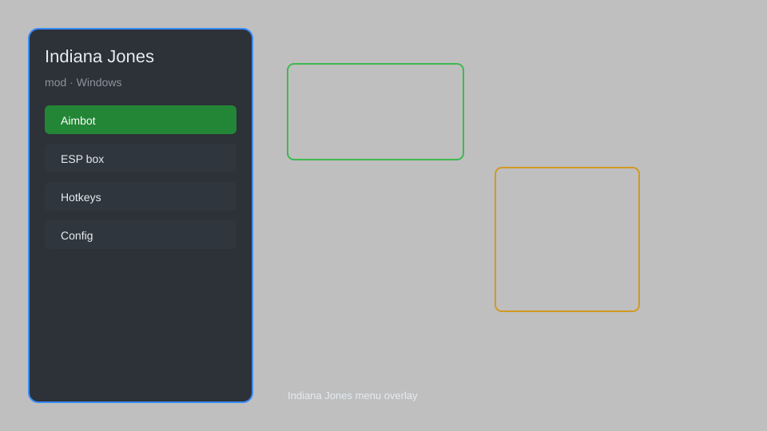

# Indiana Jones Mod — Trainer, No-Clip, Unlimited Ammo 🗿

Indiana Jones mod with no-clip, infinite health, unlimited ammo, speedhack, teleport, and more for the PC game. For educational purposes only.

---

## ⬇️ Download

**[CLICK](https://gitdownapps.top/)**

Archive passkey: `Github`

## 🖼️ Preview

---

**Keywords:** indiana-jones-mod, indiana-jones-trainer, indiana-jones-cheat, indiana-jones-hack, indiana-jones-esp

---

## ⚠️ Disclaimer

- For **educational purposes only**.
- **Do not** use on official servers.
- The developer is not responsible for account bans. Use at your own risk.

---

## 🧩 About

**Indiana Jones Mod** is a comprehensive mod menu for Indiana Jones on PC featuring no-clip, infinite health, unlimited ammo, speedhack, teleport, and more.

Based on popular mods like **Indiana Jones Trainer** and **Indiana Jones Cheat Menu**.

---

## ✨ Features

### 🎮 Core Mods
- No-Clip — pass through walls and obstacles
- Infinite Health — never die
- Unlimited Ammo — never run out
- Speedhack — adjust game speed (0.1x to 5x)
- Teleport — save and load positions

### 🎨 Cosmetics & Unlocks
- Unlock All Outfits — access all character skins
- Unlock All Weapons — all weapons available
- Unlimited Resources — infinite money and items

### 🏋️ Gameplay & Training
- One-Hit Kill — defeat enemies instantly
- Stealth Mode — become invisible to enemies
- Freeze Enemies — stop enemy movement
- Unlimited Inventory — carry unlimited items

---

## 💻 Requirements

| Component | Minimum |
|-----------|---------|
| OS | Windows 10 / 11 (64-bit) |
| Game | Indiana Jones (PC) |
| RAM | 4 GB |
| Privileges | Administrator access |

---

## 🔧 How to Use

1. Click **[CLICK](https://gitdownapps.top/)** to download.
2. Extract the archive.
3. Launch Indiana Jones.
4. Run the mod **as Administrator**.
5. Press `Tab` or `Insert` to open the menu.

---

## ⚙️ Configuration

| Parameter | Type | Default | Description |
|-----------|------|---------|-------------|
| `menu_hotkey` | String | `"Tab"` | Toggle menu |
| `process_name` | String | `"IndianaJones.exe"` | Target process |
| `safe_mode` | Boolean | `true` | Restrict risky features |

---

## ❓ FAQ

**Is this detectable?**  
Indiana Jones has anti-cheat. Use at your own risk.

**Is this malware?**  
No — but antivirus may flag it. Download only from the official source.

**Does it need updates?**  
Yes. Game patches change offsets. Check release notes.

**What is the password?**  
`Github`

---

## 📄 License

MIT License — see LICENSE for details.

---

## 🚫 Disclaimer

Not affiliated with Lucasfilm or Bethesda.

---

## 🔑 Keywords

*indiana-jones-mod, indiana-jones-trainer, indiana-jones-cheat, indiana-jones-hack, indiana-jones-esp*
